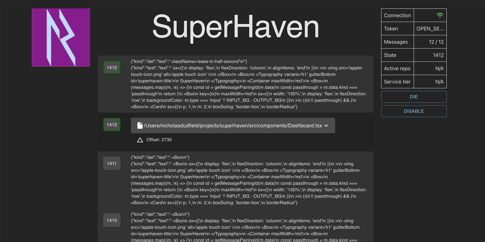

# SuperHaven

For SuperMaven editor plugin developers, this is a web-based viewer for the SuperMaven agent's stdio,
which can be quite busy with all the file content (though it's much better now that `touch  ~/sm-log.txt` works)

See [src/types/messages.ts](src/types/messages.ts) for the message types.



## About

This contains a wrapper script for the [SuperMaven](https://supermaven.com/) sm-agent binary.
It wraps the binary in a Node.js process and exposes a WebSocket API that publishes the
agent's stdio for viewing in a browser.

Having a structured log viewer makes the sm-agent much more accessible and relieves
the developer from the mental burden of parsing the agent's output.

## Usage

### Prerequisites

```bash
git clone https://github.com/sublimator/superhaven.git
cd superhaven
pnpm install
```

### Configuration

You need to create a `superhaven.config.json` file in ~/.supermaven with this structure:

```json
{
  "binaryDirectory": "~/.supermaven/binary/v9/macosx-aarch64",
  "logFile": "~/.supermaven/superhaven.log",
  "authToken": "OPEN_SESAME",
  "projects": {
    "superhaven": {
      "root": "~/projects/superhaven",
      "ignoreGlobs": [
        "**/.env"
      ]
    }
  }
}
```

### Building and installing agent wrapper

```bash
pnpm build:wrapper
```

We use a symlink to the dist directory so that any modifications to the wrapper
are available without extra effort.

```bash
# Install the symlink
cd ~/.supermaven/binary/v9/macosx-aarch64 # depends on version/arch 
mv sm-agent sm-agent-real
ln -s $REPO_ROOT/dist/sm-agent-wrapper.js sm-agent
chmod +x sm-agent
```

TODO: pnpm install $path-to-binary

### Viewing the SuperHaven Dashboard

```bash
pnpm dev:open
```
